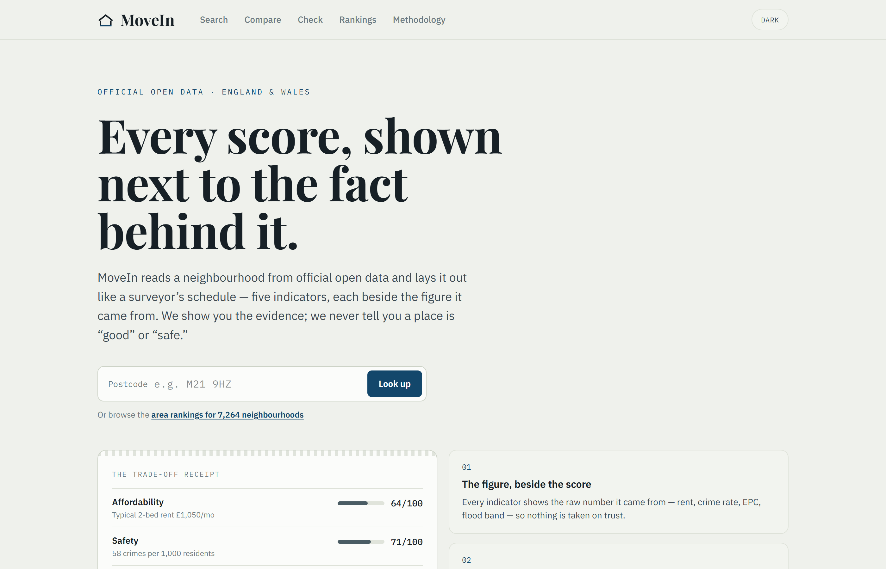

# England & Wales Housing Decision Support

**A tested dbt + DuckDB pipeline that turns
nine authoritative/open-data sources into explainable, documented neighbourhood
indicators — with published lineage, 228 data tests + 2 dbt unit tests, and a
reproducible fixture-to-full build.**

The engine rolls fragmented public housing data up to a consistent MSOA grain
(7,264 England & Wales neighbourhoods) and derives five transparent 0–100
indicators: affordability, recorded crime, energy, flood resilience and
convenience. Each is kept beside the raw figure it came from, with per-area
evidence quality driven by coverage, provenance and source grain. Missing data
lowers evidence quality; it never silently becomes a zero. The "where to live"
framing is the vehicle. The substance is the pipeline, the dimensional and
decision modelling, the tests, and the explainability layer.

> **Scope.** A reference analytics-engineering project, not a product — the UK
> area-data space is already well served (CrystalRoof, Plumplot, PostcodeCheck, …).
> It's an end-to-end data stack built over official open data.
>
> The website and repository now share one descriptive identity: **England &
> Wales Housing Decision Support**. The repository slug is
> `england-wales-housing-decision-support`.

[](https://github.com/rosscyking1115/england-wales-housing-decision-support/actions/workflows/ci.yml)
[](LICENSE)



> One of three UK open-data builds on my profile — siblings
> [tfl-data-engineering](https://github.com/rosscyking1115/tfl-data-engineering)
> (Spark/Airflow/MCP at scale) and
> [community-energy-flex](https://github.com/rosscyking1115/community-energy-flex)
> (a decision system with LP/MILP optimisation and a forecast-vs-actual retro).
> Full project map → [profile](https://github.com/rosscyking1115).

## Live

| Surface | URL |
|---|---|
| 🌐 **Housing decision-support website** (Next.js / Vercel) | https://uk-housing-decision-support.vercel.app |
| ⚙️ **API** (FastAPI / Fly.io) — OpenAPI docs | https://uk-housing-decision-support-api.fly.dev/docs |
| 📊 **dbt docs** (lineage + column catalogue) | https://rosscyking1115.github.io/england-wales-housing-decision-support/ |

## Architecture

The dbt + DuckDB warehouse is the centre of gravity. It builds a small
read-only `decision.duckdb` extract that a thin FastAPI service serves; a Next.js
website is one HTTP client of it. The clients exist to show the modelling is
frontend-agnostic and consumable; they are not the point.

```text
  dbt + DuckDB engine  ──►  data/decision.duckdb  ──►  API (FastAPI, api/)
  (9 source families)          (slim extract)            │  /v2 + OpenAPI
                                                         │
                                                  Website (web/, Next.js)
                                                  — a thin demo client
```

The transformation is specified by a versioned machine-readable contract and
golden cases under [`contracts/`](contracts/). The dbt mart, API reweighting and
TypeScript reweighting are kept in parity by tests.
(A Streamlit MVP and an Expo mobile client were also built and are now parked;
the maintenance policy closes the feature roadmap.)

### Market metric catalogue

| Metric | Declared owner and grain | Meaning and caveat |
|---|---|---|
| Area sale context | `rpt_area_profile_mvp` — one MSOA `area_id` | Latest configured-year matched-sale median, count, year and confidence state. It is **area context, not valuation**. |
| Regional price change | `rpt_price_yoy_by_region` — region × `transferred_year` | Same-region change between consecutive calendar-year medians; absent prior year remains null. Analytical reporting only. |
| Regional new-build premium | `rpt_new_build_premium` — region × `transferred_year` | New-build versus existing median for the same regional year; null when the existing-sale denominator is missing or zero. Analytical reporting only. |

The metrics intentionally stay at their source-supported grains. The reference
build does not infer an MSOA YoY rate or a property price from regional figures.

**Worked area-contract example.** The API golden case for MSOA `E02006959`
contains a matched-sale median of **£267,295**, from **417** matched sales in
the configured **2025** reference year, with a `reliable` confidence state.
That is evidence about the area's recorded-sale context in the test fixture —
not a valuation of a home, forecast, or promise about a live extract refresh.

## Repository layout

| Path | What |
|---|---|
| `models/` | dbt models: sources → staging → intermediate → marts (the engine). |
| `seeds/`, `macros/`, `analyses/` | dbt seeds (fixtures + name lookups), reusable macros (`haversine_km`, `median_anchored`), ad-hoc analyses. |
| `scripts/` | Data prep/load scripts for the real (non-fixture) sources. |
| `orchestration/` | **Dagster asset graph** over the monthly refresh: ingestion (+ a pre-dbt data-quality gate) → dbt → decision extract. |
| `tests/` | 222 dbt data tests + 2 dbt unit tests + Python/API regression suites. |
| `api/` | **FastAPI service** over the decision marts (resolve / search / listing-check / areas index / meta). `Dockerfile` + `fly.toml`. |
| `web/` | **Housing decision-support website** — Next.js. Search, compare, listing checker, and ~7k programmatic area/town/region/rent pages. See [`web/README.md`](web/README.md) and [`web/DESIGN_BRIEF.md`](web/DESIGN_BRIEF.md). |
| `data/` | Local DuckDB warehouse + the committed `decision.duckdb` extract the API ships. |
| `DEPLOY.md` | Runbook for deploying the API (Fly.io) and website (Vercel). |

The website's search map uses MapLibre GL JS with the keyless OpenFreeMap tile
service, so it has no usage-based map API bill. The provider is free and
open-source but offers no availability SLA; all search results remain usable as
an ordinary list if map tiles are unavailable.

Two reference docs at the repo root carry the modelling detail:
[`HOUSING_AREA_PROFILE_CONTRACT.md`](HOUSING_AREA_PROFILE_CONTRACT.md) (the
per-area output contract) and
[`HOUSING_DECISION_SUPPORT_DATA_SOURCES.md`](HOUSING_DECISION_SUPPORT_DATA_SOURCES.md)
(every source, its licence, and its coverage).

## The data engine

A complete, tested analytics-engineering pipeline is the project's credibility:
sources → staging → intermediate → marts (dimensions / facts / reporting), tested
at every layer, with lineage and column-level docs published to GitHub Pages on
every push. Nine authoritative/open-data source families support the output.

| Signal | Coverage | Notes |
|---|---|---|
| Sale-market context (HM Land Registry) | 4.99M transactions, 2021–2025 | Long-term market layer; median sale price per area. |
| Geography (ONSPD) | 2.73M postcodes → 7,264 E&W MSOAs | 99.999% Land Registry coverage; readable area/LA/region names. |
| Rent + affordability (ONS PIPR) | 100% of MSOAs | Local-authority rent incl. **per-bedroom** (1/2/3/4+). |
| Energy (EPC) | 100% (23.5M certificates) | Per-area median EPC band. |
| Crime (Police API) | 99.6% (17.1M crimes) | Approx. monthly rate per 1,000 — indicator only. |
| Population (ONS mid-year estimates) | 7,264 MSOA 2021 areas | Compatible mid-2024 denominator for the monthly crime rate. |
| Planning constraints (Planning Data Platform) | England only | Wales is explicitly not covered; no favourable zero default. |
| Flood (Environment Agency zones via Planning Data Platform) | England only | Share of postcodes intersecting a zone; Wales is explicitly not covered. |
| Convenience (OpenStreetMap) | 100% (437k amenities) | Nearest supermarket/school/GP/park/station + walkable count. |

Each external source is **fixture-default for fast, reproducible CI**, with a
real-data toggle (`--vars '<source>: …'`) for production builds. Explainable
scoring (`rpt_neighbourhood_score`) turns these into five 0–100 component scores,
a weighted overall, per-area evidence quality, and a "why this area" line.
Potential additions such as door-to-door commute time are deliberately outside
the active maintenance scope; station proximity remains the published transport indicator.

Geography, the source toggles, and the full per-source prep commands are detailed
in [`HOUSING_DECISION_SUPPORT_DATA_SOURCES.md`](HOUSING_DECISION_SUPPORT_DATA_SOURCES.md)
and the [Source attribution](#source-attribution) section.

### How a recommendation is explained

The score is a transformation you can read top to bottom, not a black box —
implemented in [`rpt_neighbourhood_score`](models/marts/decision/rpt_neighbourhood_score.sql):

1. **Per-indicator normalisation → 0–100.** Continuous indicators (rent-to-income
   ratio, crime rate, station distance) use a **median-anchored, winsorised
   min-max** via the [`median_anchored`](macros/median_anchored.sql) macro: clip to
   the 2nd/98th percentile, then map p2→0, median→50, p98→100. This keeps
   *magnitude* (unlike a pure percentile rank, which forces a uniform spread and
   makes every area look extreme). Categorical/absolute indicators use fixed
   anchors — EPC band (A=100 … G=0), flood = share of postcodes in a flood zone.
2. **Overall = weighted _geometric_ mean** of the indicators an area actually has
   (floored at 1), so one excellent pillar can't mask a poor one. Weights are
   configurable via dbt `vars`; a client can re-weight from the stored component
   scores without recomputing the marts.
3. **Missing indicators are dropped, never zeroed** — an absent signal lowers the
   area's evidence-quality level (`strong`/`mixed`/`limited`) instead of
   silently penalising it.
4. **Every score ships beside its raw figure** (rent, crime rate, EPC band) and a
   generated `why_this_area` sentence, so the output is auditable.

Because it's one SQL transformation, the logic is covered by the same data tests
as everything else (score bounds 0–100, coherence, and coverage/evidence rules).

## Orchestration (Dagster)

Land Registry data refreshes monthly, so the refresh is modelled as a
**Dagster asset graph** ([`orchestration/`](orchestration/)) rather than a
sequence of hand-run scripts: six ingestion assets (the Land Registry spine is
downloaded automatically; five reference sources load from locally prepared
files) feed the whole dbt project and end at `decision_extract`, the slim
DuckDB file the API ships. The dbt project loads via `dagster-dbt`, so every
model is an asset and every dbt test an asset check in the same lineage.

<p align="center">
  
</p>

Two design points worth reading the code for:

- **Data-quality gates *before* dbt.** dbt tests run after load; every
  ingestion asset is gated *before* it. The raw Land Registry parquet is
  validated in [`orchestration/checks.py`](orchestration/checks.py) (row-count
  floor, price/date null-flood, malformed-postcode rate), and each reference
  source carries a `prepared_file_is_sane` check evaluated before its
  drop-and-recreate load — without it, a truncated prepared file would
  replace a good warehouse table. A failed gate halts the graph at the front
  door instead of propagating into the marts.
- **The orchestrated build is the real refresh.** It parses *and* builds dbt
  with the real-source vars, while plain `dbt build` keeps the fixture-seed
  default for fast, reproducible CI. One `full_refresh` job runs the whole
  pipeline (steps serialized — DuckDB is a single-writer file on Windows).

Why Dagster and not Airflow: this is a set of data assets with lineage, not a
task DAG — the asset/materialization model fits, and dbt lineage flows into the
same graph. Freshness is declared (35-day warn on the warehouse spine and the
extract, mirroring dbt's source freshness) and a monthly schedule is defined in
code, but ships **switched off**: the full source archives are large/licensed
and refreshed manually, so the job runs on demand
(`dagster dev -m orchestration.definitions`). Pretending a scheduler runs in
production would be theatre. Details and trade-offs in
[`orchestration/README.md`](orchestration/README.md).

## Running locally

### 1. The engine (dbt + DuckDB)

```bash
git clone https://github.com/rosscyking1115/england-wales-housing-decision-support.git
cd england-wales-housing-decision-support
python -m venv .venv
# Windows: .\.venv\Scripts\Activate.ps1   |  macOS/Linux: source .venv/bin/activate
python -m pip install --upgrade pip && pip install -r requirements.txt
dbt deps

mkdir -p ~/.dbt && cp profiles.yml.example ~/.dbt/profiles.yml   # one-time

python scripts/download_raw.py     # --sample for a faster 2-year run
python scripts/load_to_duckdb.py
dbt seed
dbt build --threads 1              # full warehouse + 228 data tests, < 5 min on a laptop
```

### 2. The API

```bash
.venv/Scripts/python -m uvicorn api.main:app --reload   # http://127.0.0.1:8000/docs
```

### 3. The housing decision-support website

```bash
cd web
cp .env.example .env.local          # points at http://127.0.0.1:8000
npm install && npm run dev          # http://localhost:3000
```

The website needs the API running. Full web docs in [`web/README.md`](web/README.md);
deploying both services is covered in [`DEPLOY.md`](DEPLOY.md).

## Testing & CI

`ci.yml` runs on every PR and gates `main` via branch protection: Python unit tests
(incl. the API suite), `dbt build --threads 1` with **228 data tests + 2 unit tests**,
source-freshness, sqlfluff, and the web lint/test/build checks.

| Layer | Count | What it catches |
|---|---|---|
| Source freshness | 1 | Stale upstream data (warn if nothing newer than 35 days). |
| Built-in row-shape | 162 | Schema bugs, FK orphans, enum drift, contract violations. |
| `dbt-utils` | 22 | Sign/range invariants, multi-column uniqueness, score bounds. |
| `dbt-expectations` | 14 | Type-cast bugs, statistical drift, format regressions. |
| Singular (`tests/assert_*.sql`) | 30 | Domain anomalies, coverage, coherence, and cross-runtime golden cases. |
| **dbt data-test total** | **228** | All passing on every `dbt build`. |
| dbt **unit** tests | 2 | Model *logic* on mock inputs: enrichment (postcode parse + region join + filter) and the scoring maths (median-anchored min-max, geometric-mean floor, missing-component rule). |
| API (`tests/test_api.py`) | 14 | Versioned OpenAPI contract, neutral comparison fields, search validation/re-rank, missing-data and jurisdiction coverage, mocked postcodes.io. |

## Modelling & scoring principles

- Explain trade-offs; never hide behind one opaque score.
- No "safe"/"unsafe" labels — measured indicators and caveats only.
- No red-to-green good/bad colouring of scores; the EPC A–G bands are the one
  official exception.
- Official and open data first; no portal scraping. Listing comparison is user-entered.
- Area-level guidance over individual-property claims unless the source supports it.
- Missing data lowers evidence quality — it never silently becomes a zero.

## Maintenance status

The project is complete as a portfolio reference implementation and has no active
feature roadmap. Maintenance is limited to source breakages, security and
dependency updates, correctness defects, and documentation that keeps published
claims aligned with the implementation. The Streamlit MVP and Expo mobile client
remain parked. See [`MAINTENANCE.md`](MAINTENANCE.md) for the acceptance policy.

## Source attribution

All sources are public and used under the
[Open Government Licence v3.0](https://www.nationalarchives.gov.uk/doc/open-government-licence/version/3/)
(OpenStreetMap under the Open Database Licence). Per-source access and prep
commands are catalogued in
[`HOUSING_DECISION_SUPPORT_DATA_SOURCES.md`](HOUSING_DECISION_SUPPORT_DATA_SOURCES.md).

- [HM Land Registry Price Paid Data](https://www.gov.uk/government/statistical-data-sets/price-paid-data-downloads) — sale-market context. Contains HM Land Registry data © Crown copyright and database right.
- [ONS Postcode Directory](https://geoportal.statistics.gov.uk/) — postcode → MSOA/LSOA/LA/region geography and name lookups. Contains OS, ONS, Royal Mail and NRS data © Crown copyright and database right.
- [ONS Price Index of Private Rents](https://www.ons.gov.uk/economy/inflationandpriceindices/datasets/priceindexofprivaterentsukmonthlypricestatistics) — local-authority rent (incl. per bedroom). Values may be provisional and revised.
- [Energy Performance Certificates](https://get-energy-performance-data.communities.gov.uk/) — per-area median EPC band (23.5M certificates). Certificates may be expired or superseded.
- [Police street-level crime](https://data.police.uk/data/) — approximate monthly crime rate per 1,000 (LSOA→MSOA), as an indicator only.
- [ONS mid-year population estimates](https://www.ons.gov.uk/peoplepopulationandcommunity/populationandmigration/populationestimates) — compatible mid-2024 MSOA population denominator for the recorded-crime rate.
- [Planning Data Platform](https://www.planning.data.gov.uk/) — per-MSOA planning-constraint count via spatial point-in-polygon.
- [Environment Agency flood-risk zones](https://environment.data.gov.uk/) — per-MSOA flood-risk band from postcode intersections, distributed through the Planning Data Platform.
- [OpenStreetMap](https://www.openstreetmap.org/) (via [Geofabrik](https://download.geofabrik.de/)) — nearest-amenity + walkable count. © OpenStreetMap contributors, Open Database Licence.

## License

[MIT](LICENSE).
