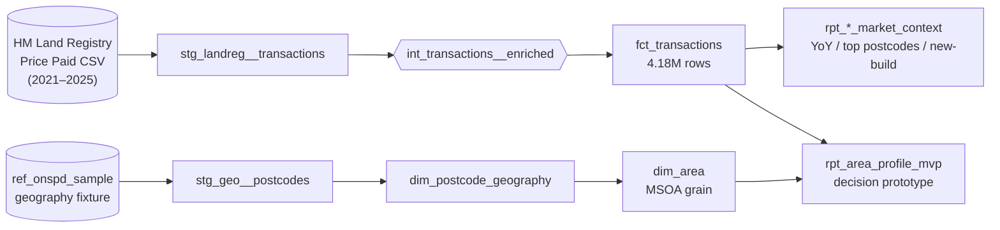

# uk-housing-decision-support

**An explainable UK neighbourhood decision-support tool for renters and movers —
built on a tested, public-data analytics-engineering spine.**

The goal: given a household's income, budget, commute target, and risk tolerance,
rank neighbourhoods (MSOA grain) as transparent trade-offs — affordability,
commute, safety indicators, energy, flood/planning risk, and long-term market
context — with confidence levels and source caveats on every recommendation.
Not a price predictor, and not a glossy listings site: an honest decision layer
over fragmented official UK datasets.

> ⚠️ **Status: prototype / work in progress.** This repo is mid-pivot from a
> finished Land Registry market-study (see *What's already built* below) into the
> decision-support tool described here. Today the engineering spine, the geography
> *contract*, and a Land-Registry-only area profile are live. The rent, EPC,
> crime, flood, planning, and commute source layers are designed but not yet
> loaded. The geography layer currently runs on a **6-postcode fixture**, not a
> real national lookup. Treat every "area profile" as a contract demo, not
> production guidance.

## Live links

- 📊 **dbt docs site (lineage + column catalogue):** https://rosscyking1115.github.io/uk-housing-decision-support/
- 📈 **Streamlit dashboard (legacy market-study UI):** https://ross-uk-property-analytics.streamlit.app/
- ✅ **CI status:** [](https://github.com/rosscyking1115/uk-housing-decision-support/actions/workflows/ci.yml) — every PR runs Python unit tests, Streamlit render/browser smoke tests, source freshness, `dbt build`, 154 data tests, dashboard extract smoke tests, and sqlfluff lint. Branch protection on `main` requires the check to pass before merging.

## Project status

| Capability | State | Notes |
|---|---|---|
| Analytics-engineering spine (dbt + DuckDB + CI + docs) | ✅ Built | Inherited from the market-study project; hardened in this pivot |
| Land Registry sale-market context | ✅ Built | 4.99M transactions, 2021–2025, tested marts |
| Geography contract (MSOA `dim_area`, postcode bridge) | ✅ Proven on a fixture | 6-postcode `ref_onspd_sample`; real ONSPD snapshot not yet pinned |
| `rpt_area_profile_mvp` (first decision mart) | ✅ Prototype | Land Registry context + caveated null placeholders for other sources |
| ONS rent / affordability | ⬜ Planned | Next source after geography is real — see `HOUSING_DECISION_SUPPORT_DATA_SOURCES.md` |
| EPC, crime, flood, planning, commute layers | ⬜ Planned | Designed in the build plan; not loaded |
| Explainable weighted neighbourhood score | ⬜ Planned | Phase 4 — component scores, confidence, "why this area" |
| Renter-facing decision app (replacing the chart dashboard) | ⬜ Planned | Phase 5 — search, ranking, compare, source/caveat views |

The full reasoning lives in four planning docs at the repo root:

- [`PROJECT_AUDIT_AND_HOUSING_FIT.md`](PROJECT_AUDIT_AND_HOUSING_FIT.md) — audit of the inherited spine and its fit for the new product.
- [`HOUSING_DECISION_SUPPORT_BUILD_PLAN.md`](HOUSING_DECISION_SUPPORT_BUILD_PLAN.md) — phased plan, target architecture, and module strategy.
- [`HOUSING_AREA_PROFILE_CONTRACT.md`](HOUSING_AREA_PROFILE_CONTRACT.md) — why MSOA, the `dim_area`/`dim_postcode_geography`/`rpt_area_profile_mvp` column contracts, and the geography test contract.
- [`HOUSING_DECISION_SUPPORT_DATA_SOURCES.md`](HOUSING_DECISION_SUPPORT_DATA_SOURCES.md) — the official/open sources, access, grain, priority, and caveats.

## Product principles

- Explain trade-offs; never hide behind one opaque score.
- No "safe"/"unsafe" labels — measured indicators and caveats only.
- Official and open data first; no portal scraping. Listing comparison is user-entered.
- Area-level guidance over individual-property claims unless the source supports it.
- Show source freshness and coverage on every recommendation; make uncertainty visible.
- Missing data lowers confidence — it does not silently become a zero.

## What's already built (the engineering spine)

The new product reuses a complete, tested analytics-engineering pipeline. This is
the part that already works end-to-end and gives the project its credibility.

Sources → staging → intermediate → marts (dimensions / facts / reporting),
tested at every layer, with lineage and column-level docs published to GitHub
Pages on every push. The original product question was a 5-year UK housing
**market study** on HM Land Registry Price Paid data (every recorded England &
Wales transaction 2021–2025, ≈4.99M rows). Those reporting marts —
`rpt_price_yoy_by_region`, `rpt_top_postcodes_by_volume`,
`rpt_new_build_premium` — now serve as the **long-term market-context layer**
for the decision tool rather than the headline product.



## Tech choices

| Layer | Tool | Why |
|---|---|---|
| Warehouse | **DuckDB** | Free, zero-ops, single-file, runs in CI. The whole 5-year warehouse fits in ~200 MB; queries return in milliseconds. |
| Transform | **dbt-core 1.11** + **dbt-duckdb 1.10** | Industry-standard analytics-engineering tooling, declared grains, tested marts, lineage. |
| Tests | **Built-in** + **dbt-utils** + **dbt-expectations** + **singular** | Row-shape, value-shape, and named-hypothesis tests. 154 data tests + 1 source-freshness check. |
| Docs | `dbt docs` → **GitHub Pages** | Free hosting, lineage graph, column-level catalogue (`.github/workflows/docs.yml`). |
| App | **Streamlit** | Python-native, read-only DuckDB connection, free Community Cloud hosting. The renter-facing decision workflow (Phase 5) will replace the current chart dashboard. |
| CI | **GitHub Actions** | `ci.yml` runs unit tests, Streamlit smoke tests, source freshness, `dbt build`, 154 data tests, dashboard extract smoke, and sqlfluff lint on every PR. `docs.yml` publishes dbt docs to Pages. Branch protection on `main` gates merges. |
| Lint | **sqlfluff 4.1** + dbt templater | Wired via `pre-commit` (local) and as a hard CI gate. |

`requirements.txt` pins are verified against PyPI for Python 3.13 (`cp313`) wheels
so a fresh clone needs no source builds — which matters on Windows.

## Test coverage

| Layer | Count | What it catches |
|---|---|---|
| Source freshness | 1 | Stale upstream data (warn if no rows newer than 35 days) |
| Built-in row-shape (`not_null`, `unique`, `accepted_values`, `relationships`) | 65 | Schema bugs, FK orphans, enum drift |
| `dbt-utils` (`expression_is_true`, `unique_combination_of_columns`) | 8 | Sign / range invariants, multi-column uniqueness |
| `dbt-expectations` (range, regex, length, distinct, quantile, row count) | 7 | Type-cast bugs, statistical drift, format regressions |
| Singular (`tests/assert_*.sql`) | 12 | Domain anomalies — non-vacuous YoY, date-spine coverage, area-profile market-match and source-caveat guards |
| **Total** | **154** | All passing on every `dbt build`; source freshness is a separate CI gate |

## Geography contract (current limitation)

Decision support needs finer geography than the legacy postcode-area region join.
The MVP grain is **MSOA**. The contract is proven — `stg_geo__postcodes` →
`dim_postcode_geography` → `dim_area`, with `rpt_area_profile_mvp` joining Land
Registry sale context onto areas — but it currently runs on the tiny committed
`ref_onspd_sample` fixture (6 postcodes), **not** a national lookup.

To prepare a real local snapshot without committing the large upstream file,
normalise an official ONSPD-style CSV/ZIP into the same column contract:

```bash
python scripts/prepare_onspd_seed.py path/to/onspd.zip --member "Data/*.csv" --snapshot-date 2026-05-01
```

The default output is `data/raw/ref_onspd_normalized.csv` (gitignored). The next
real milestone is to **pin the first official snapshot, load it behind the same
interface, and measure Land Registry postcode coverage** (target: ≥95% of fact
rows map to an `area_id`).

## How to run from a fresh clone

```bash
# 1. Clone + venv
git clone https://github.com/rosscyking1115/uk-housing-decision-support.git
cd uk-housing-decision-support
python -m venv .venv
# Windows: .\.venv\Scripts\Activate.ps1   |  macOS/Linux: source .venv/bin/activate
python -m pip install --upgrade pip
pip install -r requirements.txt
dbt deps

# 2. Profile (one-time)
mkdir -p ~/.dbt
cp profiles.yml.example ~/.dbt/profiles.yml

# 3. Pull data + load + build (5-year default ~3-5 min, --sample for a fast 2-year run)
python scripts/download_raw.py     # use --sample for a faster 2-year run
python scripts/load_to_duckdb.py
dbt seed
dbt build
```

A fresh clone reproduces the full warehouse + 154 data tests in under 5 minutes
on a laptop. To re-publish docs locally: `dbt docs generate && dbt docs serve`.

## Roadmap

The phased plan lives in [`HOUSING_DECISION_SUPPORT_BUILD_PLAN.md`](HOUSING_DECISION_SUPPORT_BUILD_PLAN.md). In short:

1. **Spine hardening** — done (this pivot).
2. **Geography foundation** — pin a real ONSPD snapshot; ≥95% Land Registry coverage; decision marts keyed on `area_id`.
3. **MVP data sources** — ONS rent first, then EPC, crime, flood/planning, commute; one tested ingestion + staging model per source.
4. **Decision marts** — explainable component scores, confidence/coverage fields, "why this area" fragments; user weights re-rank without changing raw facts.
5. **Renter-facing app** — search/preferences, ranked areas, compare, per-area "trade-off receipt", source/caveat views.
6. **Quality gates** — score-bound, coverage, and explanation-completeness tests; UI accessibility review.
7. **Deployment** — Streamlit Cloud + GitHub Pages + slim committed extract.

Known prototype caveats to address before anything is user-facing:

- Geography is fixture-only; no real national coverage yet.
- Small-sample area medians are unguarded (a Westminster fixture area shows a £13M median from 2 matched sales); `confidence_level` is currently a hardcoded global `'low'` and needs to reflect sample depth per area.
- No live rental-listing coverage is claimed or scraped — listing comparison will be user-entered.

## Source attribution

[HM Land Registry Price Paid Data](https://www.gov.uk/government/statistical-data-sets/price-paid-data-downloads),
public dataset, monthly updates. Used under the
[Open Government Licence v3.0](https://www.nationalarchives.gov.uk/doc/open-government-licence/version/3/).
Contains HM Land Registry data © Crown copyright and database right.

Planned sources (ONS rents, ONS/geography postcode lookup, EPC, Police API,
Planning Data API, Environment Agency flood data, TfL, OpenStreetMap) and their
licences/caveats are catalogued in [`HOUSING_DECISION_SUPPORT_DATA_SOURCES.md`](HOUSING_DECISION_SUPPORT_DATA_SOURCES.md).

## License

[MIT](LICENSE).
</content>
</invoke>
